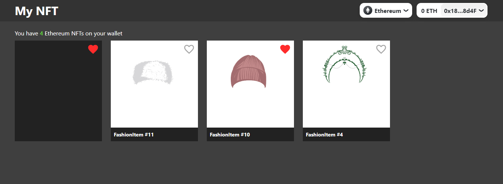
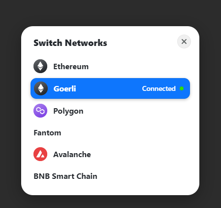

# 🖼 NFT 🖼 List | For all chains

## Build with Next.js+TypeScript

### Ethereum Mainnet, Goerli Testnet, BNB Smart Chain, Avalanche, Polygon, Fantom ....

<br>

## Requirement

Create a basic web app using typescript and react that has the following functionality:

- Button that allows the user to connect their eth wallet
- Once the wallet is connected, it should display any NFTs in a basic list
- The user state should be saved to a database

## Install

```
npm install
yarn install
```

## Run

Run on `localhost:3000`

```
npm run dev
yarn dev
```

## Main Package

- Rainbow Kit + Wagmi (Set network and wallet connect)
- Moralis (Get NFT data)
- Google Firebase (Manage NFT data - Database)

### npm modules

- @rainbow-me/rainbowkit
- wagmi
- moralis
- firebase

<p align="center">
    
</p>

<p align="center">
    
</p>
